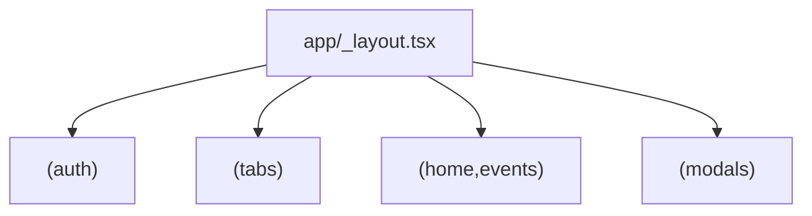

# Native Optimization Pass

## Rules Applied

- `projectrules`
- `react-native-best-practices`
- `Uniwind-styling`
- `styling-guidelines`
- `fresh-context` via Exa + Context7 package/docs checks

## What I Verified

- The root router is still a flat stack in [app/_layout.tsx](c:\Users\Peter\esco-beach-club\app_layout.tsx), and auth protection is done with `useEffect` redirects rather than router-native protected screens.
- The modal route in [app/modal.tsx](c:\Users\Peter\esco-beach-club\app\modal.tsx) renders React Native `Modal` inside an Expo Router modal route, which is an architecture mismatch.
- The app already uses `expo-image`, `FlashList`, Reanimated 4, and React Compiler, but several screens do not yet follow the installed stack’s best practices.
- The highest confirmed render hotspots are [providers/DataProvider.tsx](c:\Users\Peter\esco-beach-club\providers\DataProvider.tsx), [app/(tabs)/index.tsx](c:\Users\Peter\esco-beach-club\app(tabs)\index.tsx), [app/invite.tsx](c:\Users\Peter\esco-beach-club\app\invite.tsx), [app/menu.tsx](c:\Users\Peter\esco-beach-club\app\menu.tsx), [app/(tabs)/events.tsx](c:\Users\Peter\esco-beach-club\app(tabs)\events.tsx), and [app/partner-modal.tsx](c:\Users\Peter\esco-beach-club\app\partner-modal.tsx).

```59:74:c:\Users\Peter\esco-beach-club\app_layout.tsx
function RootLayoutNav() {
  return (
    <Stack screenOptions={{ headerBackTitle: 'Back' }}>
      <Stack.Screen name="(tabs)" options={{ headerShown: false }} />
      <Stack.Screen name="login" options={{ headerShown: false, animation: 'fade' }} />
      <Stack.Screen name="signup" options={{ headerShown: false, animation: 'slide_from_right' }} />
      <Stack.Screen name="modal" options={{ presentation: 'modal', headerShown: false }} />
      // ...more sibling screens...
    </Stack>
  );
}
```

```8:13:c:\Users\Peter\esco-beach-club\app\modal.tsx
<Modal
  animationType="fade"
  transparent={true}
  visible={true}
  onRequestClose={() => router.back()}
>
```

```123:136:c:\Users\Peter\esco-beach-club\providers\DataProvider.tsx
  return {
    profile,
    profileLoading: false,
    events,
    eventsLoading: false,
    news,
    newsLoading: false,
    partners,
    partnersLoading: false,
    referrals,
    referralsLoading: false,
    dismissVoucher,
    userId,
  };
```

## Target Route Shape




Planned ownership:

- Auth routes move under [app/(auth)/](c:\Users\Peter\esco-beach-club\app(auth)) for `login` and `signup`.
- Each tab gets its own nested stack under [app/(tabs)/](c:\Users\Peter\esco-beach-club\app(tabs)) so push history is owned by the tab instead of the flat root stack.
- Shared event details move from [app/event-details.tsx](c:\Users\Peter\esco-beach-club\app\event-details.tsx) to a shared route such as `events/[id]` in a common group.
- Modal-only flows move under a dedicated modal group so booking, partner, private-event, rate-us, and success are configured once and presented consistently.

## Plan

### 1. Rebuild the Router Topology First

Touch:

- [app/_layout.tsx](c:\Users\Peter\esco-beach-club\app_layout.tsx)
- [app/(tabs)/_layout.tsx](c:\Users\Peter\esco-beach-club\app(tabs)layout.tsx)
- new grouped layouts under [app/](c:\Users\Peter\esco-beach-club\app)

Work:

- Split the flat root stack into grouped layouts for `(auth)`, `(tabs)`, a shared detail group, and `(modals)`.
- Move tab-owned screens like `menu` and `invite` under their natural parent tab stacks.
- Convert flat detail/modals toward semantic route paths instead of stringly typed global siblings.

Why first:

- This unlocks cleaner native back behavior, safer deep-link handling, and a better place to apply modal defaults and protected-route rules.

### 2. Replace Redirect Auth With `Stack.Protected`

Touch:

- [app/_layout.tsx](c:\Users\Peter\esco-beach-club\app_layout.tsx)
- [providers/AuthProvider.tsx](c:\Users\Peter\esco-beach-club\providers\AuthProvider.tsx)

Work:

- Remove the current `useEffect` redirect gate.
- Use `Stack.Protected` to expose `(auth)` only when logged out and the main app groups only when logged in.
- Keep the loading state, but stop tying auth transitions to raw segment string checks.

Docs basis checked:

- Context7 returned current Expo docs for `Stack.Protected` and modal anchoring.

### 3. Normalize Modals To Route-Driven Screens Only

Touch:

- [app/modal.tsx](c:\Users\Peter\esco-beach-club\app\modal.tsx)
- [app/partner-modal.tsx](c:\Users\Peter\esco-beach-club\app\partner-modal.tsx)
- [app/booking-modal.tsx](c:\Users\Peter\esco-beach-club\app\booking-modal.tsx)
- [app/private-event.tsx](c:\Users\Peter\esco-beach-club\app\private-event.tsx)
- [app/rate-us.tsx](c:\Users\Peter\esco-beach-club\app\rate-us.tsx)
- [app/success.tsx](c:\Users\Peter\esco-beach-club\app\success.tsx)

Work:

- Remove the nested React Native `Modal` usage from the modal route.
- Consolidate modal presentation settings in a modal-group layout instead of per-screen duplication where possible.
- For booking/success, model them as a small route flow instead of unrelated root siblings.
- Revisit whether some screens should use `formSheet` instead of generic `modal`.

### 4. Apply the Highest-ROI Render and List Optimizations

Touch:

- [app/(tabs)/index.tsx](c:\Users\Peter\esco-beach-club\app(tabs)\index.tsx)
- [app/invite.tsx](c:\Users\Peter\esco-beach-club\app\invite.tsx)
- [app/menu.tsx](c:\Users\Peter\esco-beach-club\app\menu.tsx)
- [app/(tabs)/events.tsx](c:\Users\Peter\esco-beach-club\app(tabs)\events.tsx)
- [app/(tabs)/perks.tsx](c:\Users\Peter\esco-beach-club\app(tabs)\perks.tsx)
- [app/partner-modal.tsx](c:\Users\Peter\esco-beach-club\app\partner-modal.tsx)

Work:

- Replace `ScrollView` + `.map()` feeds where growth is unbounded or likely to grow.
- Add `estimatedItemSize` to `FlashList` usages.
- Add `expo-image` `recyclingKey` in recycled list rows and consider placeholders for high-visibility remote images.
- Split heavy inline list header/footer trees into memoized components where it reduces rerender pressure.
- Replace the expensive full-screen blurred background approach in the partner modal with a lighter alternative.

Docs basis checked:

- Exa + Context7 confirmed `expo-image` list-view guidance, including `recyclingKey`, and FlashList’s `estimatedItemSize` guidance.

### 5. Reduce Rerender Fan-Out In State And Forms

Touch:

- [providers/DataProvider.tsx](c:\Users\Peter\esco-beach-club\providers\DataProvider.tsx)
- [app/private-event.tsx](c:\Users\Peter\esco-beach-club\app\private-event.tsx)
- [app/rate-us.tsx](c:\Users\Peter\esco-beach-club\app\rate-us.tsx)

Work:

- Break the broad `useData()` subscription surface into narrower selectors/hooks so small updates do not rerender unrelated screens.
- Replace whole-screen `watch(...)` usage with narrower subscriptions for only the UI fragments that need live updates.
- Keep React Compiler-safe Reanimated usage with `.get()` / `.set()` intact.

### 6. Remove Dead Paths And Verify

Touch:

- [lib/supabase.ts](c:\Users\Peter\esco-beach-club\lib\supabase.ts)
- [package.json](c:\Users\Peter\esco-beach-club\package.json)
- route callers across [app/](c:\Users\Peter\esco-beach-club\app)

Work:

- Confirm whether the dormant Supabase + AsyncStorage path should be removed now or left pending the separate InstantDB/MMKV migration.
- Remove unused icon dependencies if they stay unused after the navigation refactor.
- Update all hardcoded route pushes to the new structure.
- Run lint and smoke-test: auth entry, tab switching, event detail, booking, partner modal, private event, invite, profile, and review flows.

## Main Risks

- Route renames will require coordinated updates to every `router.push(...)` call.
- Shared-detail groups and modal anchors need careful setup so back behavior stays intuitive from multiple tabs.
- If booking stops taking loose string params and starts resolving by id, a small data-loading refactor will be needed in the booking flow.
- If Supabase removal is bundled into this pass, it overlaps with the separate InstantDB/MMKV migration already planned in the repo.

## Acceptance Criteria

- The app uses grouped Expo Router layouts instead of a flat sibling-heavy root stack.
- Auth protection uses `Stack.Protected` rather than segment-based redirect effects.
- No route screen presented as an Expo modal also renders a nested React Native `Modal`.
- High-traffic lists follow FlashList/image best practices where applicable.
- `DataProvider` and form screens have narrower subscription surfaces.
- Critical flows lint clean and navigate correctly with the new route topology.

