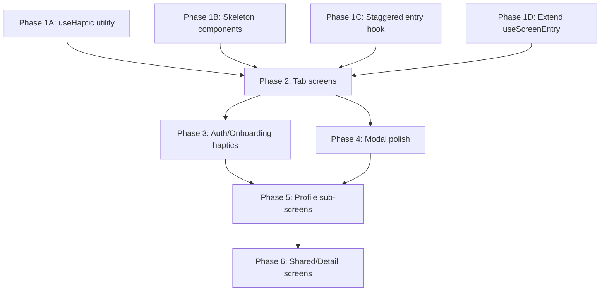

# Screen Enhancement Plan

## Current State Summary

The app has **44 routes** across 5 tabs, auth/onboarding, modals, and shared screens. The animation infrastructure is lean but solid:

- [motion.ts](src/lib/animations/motion.ts) — duration/easing/spring tokens + `withRM` for Reduced Motion
- [use-screen-entry.ts](src/lib/animations/use-screen-entry.ts) — opacity + translateY fade-in (used in 2 screens)
- [use-button-press.ts](src/lib/animations/use-button-press.ts) — scale press feedback (used in `Button`, `SurfacePressableCard`, onboarding)

### Audit Results

| Area                    | Entering Anim                      | Haptics | Skeleton | List Stagger | Exiting Anim |
| ----------------------- | ---------------------------------- | ------- | -------- | ------------ | ------------ |
| Onboarding (5 screens)  | Good (FadeIn/Up, ZoomIn, floating) | None    | None     | Partial      | None         |
| Home tab                | Partial (useScreenEntry)           | None    | Spinner  | None         | None         |
| Events tab              | **None**                           | None    | Spinner  | None         | None         |
| QR tab                  | **None**                           | None    | None     | None         | None         |
| Perks tab               | **None**                           | None    | Spinner  | None         | None         |
| Profile tab             | Partial (voucher spring)           | None    | None     | None         | None         |
| Profile sub-screens (8) | Partial (membership, invite)       | None    | None     | None         | None         |
| Modals (5)              | Partial (mount springs)            | None    | None     | None         | None         |
| Event detail            | Custom fade/slide                  | None    | None     | None         | None         |
| Auth (login/signup)     | CTA scale only                     | None    | None     | None         | None         |

**Zero screens use haptics. Zero screens use skeletons. Zero screens use exiting or layout animations.**

---

## Phase 1: Shared Infrastructure (foundation for everything else)

### 1A. Create `useHaptic` utility

New file: `src/lib/haptics/use-haptic.ts`

- Wrap `expo-haptics` with iOS-only guard (`process.env.EXPO_OS`)
- Expose helpers: `hapticLight()`, `hapticMedium()`, `hapticSuccess()`, `hapticError()`, `hapticSelection()`
- All no-op on Android (or use Android vibration API if desired later)

### 1B. Create skeleton components

New file: `src/components/ui/skeleton.tsx`

- `Skeleton` — a rounded `Animated.View` with a pulsing opacity loop (`withRepeat` + `withTiming`, respects `ReduceMotion.System`)
- Variants: `SkeletonText` (narrow bars), `SkeletonCard` (full card shape), `SkeletonAvatar` (circle)
- Uses motion tokens: `motion.dur.xl` for pulse cycle

### 1C. Create staggered list animation hook

New file: `src/lib/animations/use-staggered-entry.ts`

- Hook that returns entering animation props for list items based on index
- `FadeInUp.delay(index * 60).duration(motion.dur.md)` pattern, capped at ~8 items to avoid long waits
- Wrapped with `withRM` for Reduced Motion

### 1D. Extend `useScreenEntry` with stagger support

Modify [use-screen-entry.ts](src/lib/animations/use-screen-entry.ts) to accept optional `delay` parameter for sequential section reveals.

---

## Phase 2: Tab Screens (highest visibility)

### 2A. Events tab — `app/(tabs)/events/index.tsx`

Currently the flattest screen. Enhancements:

- **Screen entry**: `useScreenEntry` on the header/filter area
- **List item stagger**: `FadeInUp` entering animation on each event card (first 8 items)
- **Heart toggle**: haptic feedback (`hapticLight`) + scale pop on save/unsave
- **Category chip select**: `hapticSelection()` on chip press
- **Loading**: Replace `ActivityIndicator` with `SkeletonCard` x 3

### 2B. Perks tab — `app/(tabs)/perks/index.tsx`

Currently static. Enhancements:

- **Screen entry**: `useScreenEntry` on header section
- **Partner card stagger**: `FadeInUp` entering on partner cards
- **Card press**: Already uses shadows; add `hapticLight()` on press
- **Loading**: Replace spinner with `SkeletonCard` x 4
- **CTA button**: Existing Da Nang CTA gets `useButtonPress` scale

### 2C. QR tab — `app/(tabs)/qr.tsx`

Membership identity screen — should feel premium. Enhancements:

- **Card reveal**: Scale + opacity spring on mount (like membership hero)
- **Haptic on show**: `hapticSuccess()` when QR becomes visible
- **Long press staff entry**: `hapticMedium()` feedback

### 2D. Home tab — `app/(tabs)/home/index.tsx`

Already has `useScreenEntry`. Enhancements:

- **News/event card stagger**: Staggered `FadeInUp` on the horizontal scroll items
- **Quick action press**: `hapticLight()` on tap
- **Loading**: Replace `ActivityIndicator` with skeleton layout (hero skeleton + card skeletons)
- **Pull-to-refresh**: Add `hapticLight()` on refresh trigger

### 2E. Profile tab — `app/(tabs)/profile/index.tsx`

Enhancements:

- **Menu row stagger**: Staggered `FadeInUp` on menu items (delay per index)
- **Avatar area**: Subtle scale-in on mount
- **Menu press**: `hapticLight()` on each row press
- **Voucher reveal**: Add `hapticSuccess()` to existing animation

---

## Phase 3: Auth and Onboarding (already best-animated, refine)

### 3A. Login — `app/(auth)/login.tsx`

- **Screen entry**: Add `FadeInUp` on form fields (staggered)
- **Input focus**: Subtle border color transition
- **Submit haptic**: `hapticMedium()` on CTA press

### 3B. Signup — `app/(auth)/signup.tsx`

- **Screen entry**: Staggered `FadeInUp` matching login
- **Step dots**: Animate active dot scale with `withSpring`
- **Submit haptic**: `hapticMedium()` on CTA press

### 3C. Onboarding screens (5 screens)

Already well-animated. Incremental:

- Add `hapticSuccess()` on permission granted
- Add `hapticLight()` on CTA press across all 5
- Add `hapticSelection()` on radio/checkbox toggles in `onboarding-local-identity`

---

## Phase 4: Modals (polish success states)

### 4A. Booking modal — `app/(modals)/booking/index.tsx`

- **Selection haptics**: `hapticSelection()` on date/time/pax/occasion select
- **Confirm CTA**: `hapticMedium()`

### 4B. Booking success — `app/(modals)/booking/success.tsx`

- Add `hapticSuccess()` on mount (celebratory)
- The existing check-icon spring is good; no change needed

### 4C. Partner modal — `app/(modals)/partner.tsx`

- **Claim button**: `hapticSuccess()` on successful claim
- **Copy action**: `hapticLight()` + existing check icon

### 4D. Private event — `app/(modals)/private-event.tsx`

- **Type picker expand**: `layout={LinearTransition}` for smooth height change
- **Submit success**: `hapticSuccess()` on spring animation
- **Form input haptics**: `hapticSelection()` on picker changes

### 4E. Rate-us — `app/(modals)/rate-us.tsx`

- **Star tap**: `hapticLight()` on each star (already has pop animation)
- **Submit success**: `hapticSuccess()`

---

## Phase 5: Profile Sub-screens

### 5A. Membership — `app/(tabs)/profile/membership.tsx`

- Already has hero pop-in. Add `hapticSuccess()` on tier reveal
- **Benefit cards**: Staggered `FadeInUp`
- **Activity loading**: Replace `ActivityIndicator` with `SkeletonText` rows

### 5B. Invite — `app/(tabs)/profile/invite.tsx`

- Already has progress bar animation. Add `hapticSuccess()` when bar completes
- **Share/copy**: `hapticLight()` on share and copy actions
- **Referral list**: Staggered `FadeInUp` on referral rows

### 5C. Edit profile — `app/(tabs)/profile/edit-profile.tsx`

- **Screen entry**: `useScreenEntry` on form container
- **Save success**: `hapticSuccess()`

### 5D. Remaining profile screens (saved-events, theme-preference, help-center, delete-account, invite-referrals)

- **Screen entry**: `useScreenEntry` on each
- **Haptics**: `hapticLight()` on interactive elements
- **Delete account**: `hapticError()` on destructive confirmation

---

## Phase 6: Shared / Detail Screens

### 6A. Event detail — `app/(shared)/events/[id].tsx`

- Already has custom fade/slide. Enhancements:
- **Hero parallax**: Scroll-driven `translateY` on hero image (shared value from scroll offset)
- **Book CTA**: `hapticMedium()` on press
- **Loading**: Skeleton layout instead of "not found" during resolution

### 6B. Not-found — `app/+not-found.tsx`

- `FadeIn` on the error message
- Friendly bounce on the "go home" CTA

---

## Implementation Order (recommended)

## Key Principles

- **Every animation respects Reduced Motion** via `withRM` or `reduceMotion: ReduceMotion.System`
- **Haptics are iOS-conditional** — `process.env.EXPO_OS === 'ios'` guard
- **Skeletons pulse, never flash** — smooth `withRepeat` + `withTiming` opacity
- **List stagger caps at 8 items** — beyond that, items enter instantly
- **No per-frame className churn** — all dynamic styles via Reanimated `style`
- **All strings remain i18n'd** — no hardcoded text additions
- **Cleanup**: every `withRepeat` / looping animation calls `cancelAnimation` on unmount
